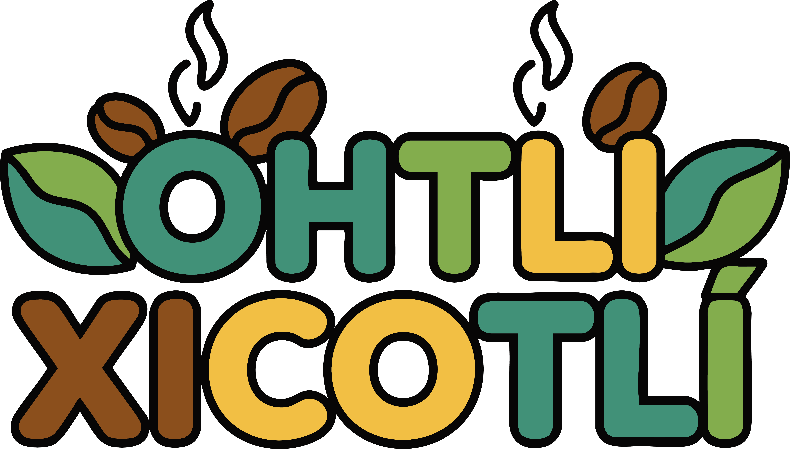

# OHTLI XICOTLÍ

> **Videojuego 2D de entretenimiento que conecta a niños con el patrimonio cultural de México**

  <table>
    <tr>
      <td align="center" width="50%">
        <!-- Logo Empresa -->
        
          
        <strong>Empresa</strong>
      </td>
      <td align="center" width="50%">
        <!-- Logo Videojuego -->
        
          
        <strong>Logo Videojuego</strong>
      </td>
    </tr>
  </table>

---

## Integrantes del Equipo

| Nombre | Matrícula | Perfil de GitHub |
|--------|-----------|------------------|
| Ana Karen Aguilar Torres | 230292 | [@Anakaren-at](https://github.com/Anakaren-at) |
| Gerardo Clemente Hernández | 230416 | [@CH-Gerardo](https://github.com/CH-Gerardo) |
| Samuel Galindo Vaquier | 230173 | [@Samuel-Galindo-Vaquier](https://github.com/Samuel-Galindo-Vaquier) |
| Mario Antonio Leyva Olivares | 230117 | [@Marioleeyva](https://github.com/Marioleeyva) |

### Docente Responsable

**M.T.I. Marco Antonio Ramírez Hernández**  
GitHub: [@MTI-MarcoRH](https://github.com/MTI-MarcoRH)

---
